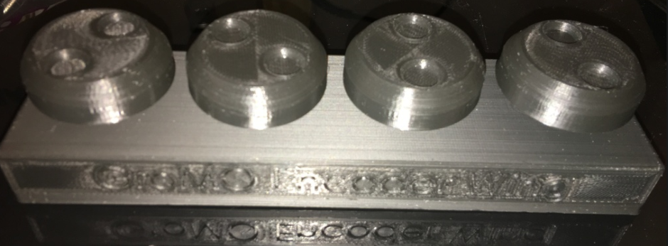
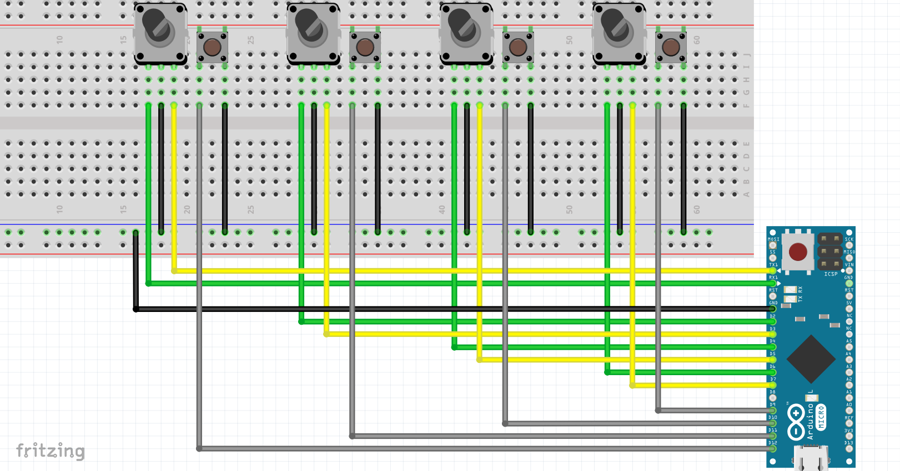
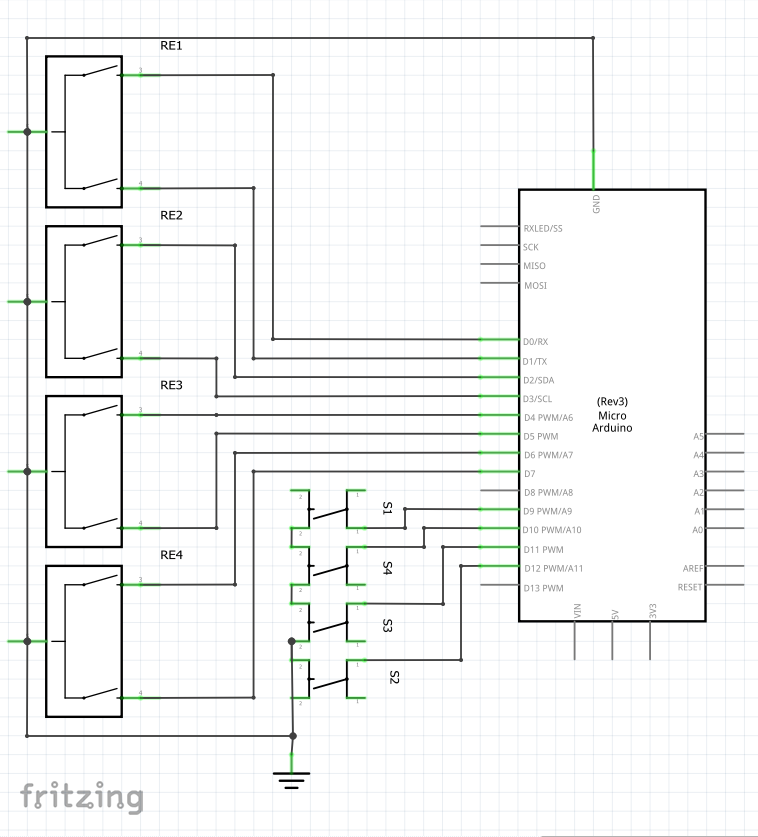

# GroMo-Encoder-Wing-1

This is a USB Wing to control the encoders wells of the GrandMA2OnPC Software, this emulate mouse scroll on the software wells.

You need to use an Arduino pro micro or any board with HID capability

***

